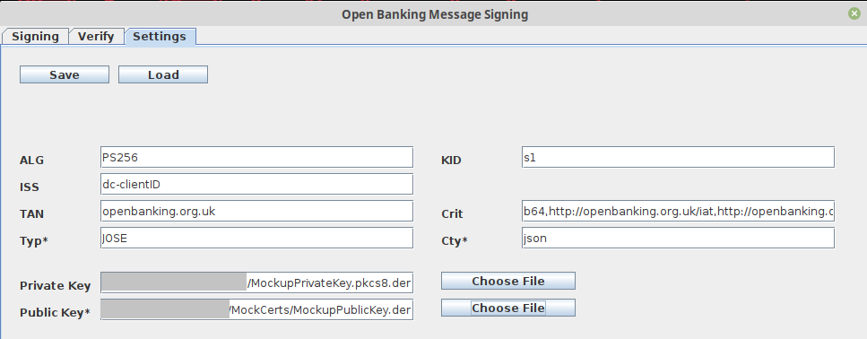
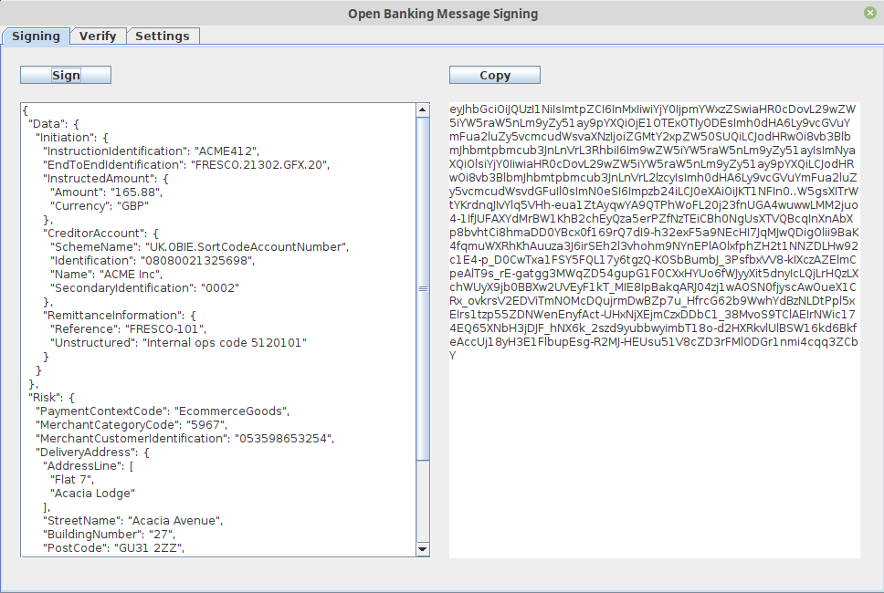
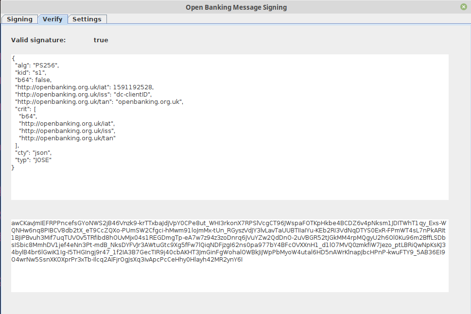

# Open Banking Message Signing

Implementation of the Open Banking message signing requirements by Context Information Security.

The tool can be used to sign payloads in accordance with the Open Banking specification for the Read/Write API (v3.1). 


Please refer to the spec to find out which endpoints require payload signing

- Version 3.1 PISP: https://openbanking.atlassian.net/wiki/spaces/DZ/pages/937754701/Payment+Initiation+API+Specification+-+v3.1


Also refer to our tooling blog post series for an intro into Open Banking and Read/Write API tooling:

- Open Banking - Open for Business: https://www.contextis.com/en/blog/open-banking-open-for-business
- Open Banking Challenges: https://www.contextis.com/en/blog/open-banking-the-challenges
- Open Banking Read/Write API Tooling: https://www.contextis.com/en/blog/open-banking-read-write-api-tooling


## Requirements 

This project requires 

- JDK 11 or higher
- Gradle 4 or higher
- Public and private key in DER format


## Build Project

Use `gradle` or `./gradlew` to build the project

```bash
gradle clean
gradle build
```


## Run Project

```bash
java -jar OpenBanking-MessageSigning-v0.1.jar
```


## Feature Details

This tool was created from the Open Banking Read/Write API version 3.1. The project may require adjustments when used for other Read/Write API versions.


### Read/Write 3.1 Specification

Parameter overview:

- https://openbanking.atlassian.net/wiki/spaces/DZ/pages/937656404/Read+Write+Data+API+Specification+-+v3.1#Read/WriteDataAPISpecification-v3.1-MessageSigning

| Parameter                       | Info                                                         |
| ------------------------------- | ------------------------------------------------------------ |
| `alg`                           | PS256 (preferred) or RS256                                   |
| `kid`                           | Signing Certificate Key                                      |
| `http://openbanking.org.uk/iss` | TPP identifier, i.e. client ID                               |
| `http://openbanking.org.uk/tan` | This **must** be a string that consists of a domain name that is registered to and identifies the Trust Anchor that hosts the public counter-part of the key used for signing. |
| `http://openbanking.org.uk/iat` | This **must** be a JSON number representing the number of seconds from 1970-01-01T0:0:0Z as measured in GMT until the date/time. |
| `crit`                          | This **must** be a string array consisting of the values "b64", "http://openbanking.org.uk/iat", "http://openbanking.org.uk/iss", "http://openbanking.org.uk/tan" |
| `typ`                           | If it is specified, it must be set to the value "JOSE"       |
| `cty`                           | If it is specified, it must be set to the value "json" or "application/json". |


### Settings

Before the signing/verify functions can be used, mandatory parameters need to be defined in the "Settings" tab.

The settings marked with ***** are **optional** values. 




The public and private key fields require the absolute path to the key files in DER format. Below are some conversions for the public and private key as they are required for the tool.

- Public certificate in PEM format to public key in DER format:

```bash
# PEM certificate to PEM public key
openssl x509 -pubkey -noout -in cert.pem  > pubkey.pem

# PEM public key to DER public key: 
openssl rsa -pubin -inform PEM -in pubkey.pem -outform DER -out pub-key.der
```

- Private key in PEM format to private key in DER format:

```bash
openssl pkcs8 -topk8 -nocrypt -in signing.key -outform der -out priv-key.der
```


Please also see the example config file "open-banking-msg-sign-config.json" provided with the repository. Note, that the path for the keys has not been added.


### Signing

Enter the payload in the left text are and click on the "Sign" button.

Another button is available to copy the detached JWT into the clipboard.

The example payload below was taken from the Read/Write API spec:




### Verify

This tab is to help with troubleshooting and allows signature verification (if the public key has been provided in the settings tab). The UI shows the signature and decoded JWT header.

